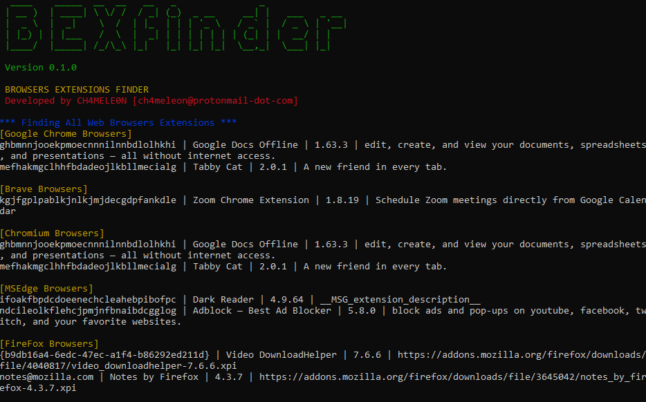

# CloudFail

Browsers Extensions Finder (BEXfinder) is a cross-platform and portable command-line tool to find all web browsers extensions (Google Chrome, Brave browsers extensions, FireFox browsers plugins) installed on system.

1. Misconfigured DNS scan using DNSDumpster.com.
2. Scan the Crimeflare.com database.
3. Bruteforce scan over 2500 subdomains.



> Please feel free to contribute to this project. If you have an idea or improvement issue a pull request!

#### Disclaimer
This tool is a PoC (Proof of Concept) and does not guarantee results.
This tool is only for academic purposes and testing  under controlled environments.
The author bears no responsibility for any misuse of the tool.


## To Run
```
go run main.go
```

## Installation
```
go install
```

### Development


## Contact
ch4meleon@protonmail-dot-com
